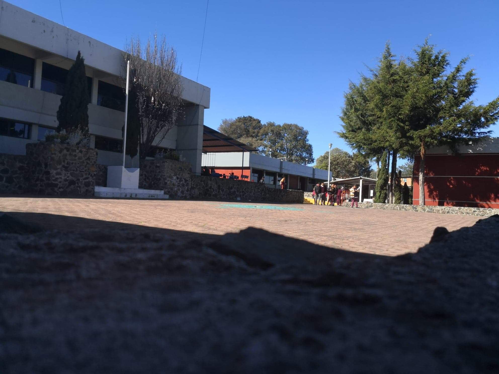

## Página principal.
### Index.html
### Versión 1.4

Proyecto de titulación en el instituto CETis 167.
"Hermanos Flores Magón"

```
Creación de README.md 30/ Junio/ 2020

Y carga de archivos globales(Todos los de la página)

Se añadió una barra de información de coronavirus. 6:00pm 30/Junio/2020

```
```
Update v1.4, efectos con AOS.js

Aumentó el tiempo de sección de vistas a 20 segundos.

fcto-animate se remplazó por data-aos=""

 02 / Julio / 2020

```
## Autor
* **Ismael Rosete** - *GACETIS* - [Lxrd17](https://github.com/Lxrd17)

